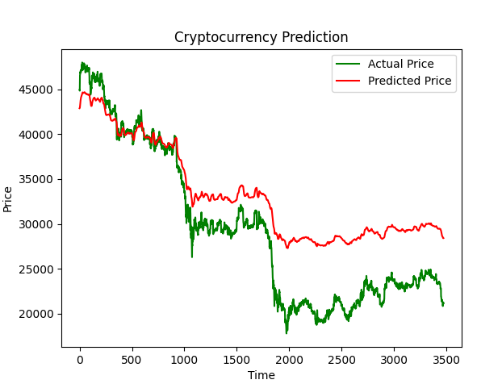
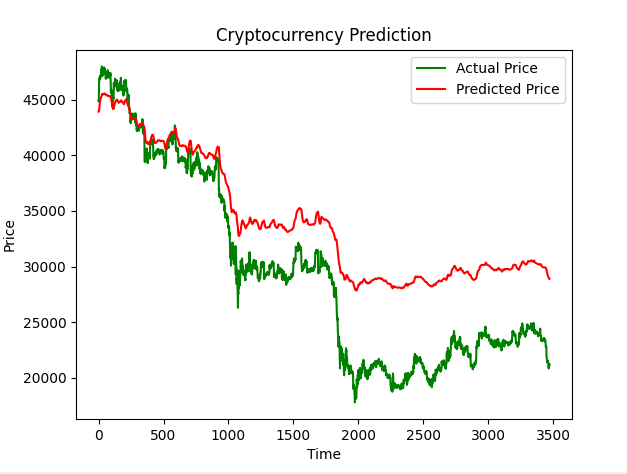

# Quant Trader

**Quant Trader** is a Python project which attempts to predict future stock market
    and cryptocurrency movement through the utilization of deep learning with long
    short-term memory layers. The project has three forms of predictions: next day
    candlestick, closing price some time in the future, and candlestick some time
    in the future.

****

### How It Works:

This program creates datasets from Alpaca API, modifies them, and then uses them to
    train a neural network to predict future close prices or candlesticks.

****

### Performance:

Trained with hourly closing values from 2020-08-20 to 2022-08-20

****

Trained with closing values from 2020-08-20 to 2022-08-20 from every minute

So far, the performance has been decent. The program is able to accurately follow
    the trends of actual price, however, it fails to match its volatility.

****

### In Progress:
- Stock predictions
  - next day candlestick
  - closing price some time in the future
  - candlestick some time in the future
- Parabolic SAR and Fibonacci Retracement (needs uptrend/downtrend)
- Cryptocurrency prediction
  - next day candlestick
  - candlestick some time in the future
- Client to trade on paper account

### APIs and Libraries:
- Alpaca API
- pandas
- numpy
- TensorFlow
- Keras
- scikit-learn
- plotly
- matplotlib 
- requests
- json
- os